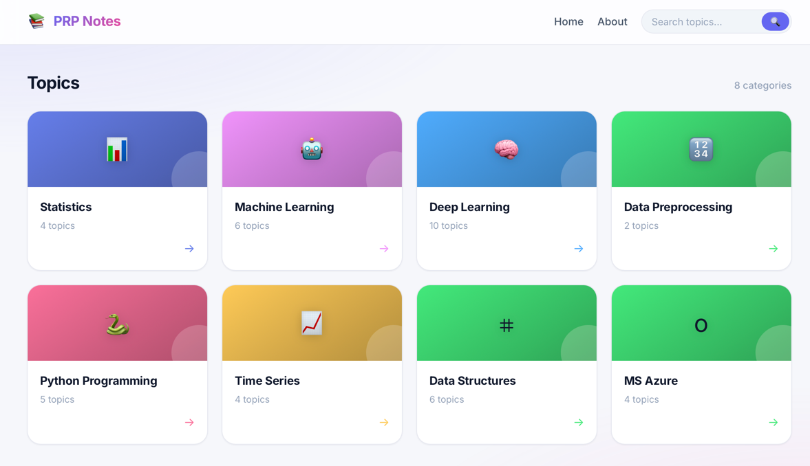

# My Data Science Study Notes 📚

#### [Website](!https://csnp.vercel.app/) (https://csnp.vercel.app/)
 
</img>
 

Hey there! This is my personal collection of study notes for Data Science, Machine Learning, and related topics. I built this simple Flask web app to keep everything organized and easy to access whenever I need to review concepts.

I've organized my notes into these main areas like:

### 📊 Statistics
- Bias-Variance Tradeoff (understanding underfitting and overfitting)
- Hypothesis Testing (t-tests, chi-square, ANOVA)
- Regression Analysis
- Probability Distributions

### 🤖 Machine Learning
- Supervised and Unsupervised Learning
- Train/Validation/Test Splits and Data Leakage
- Model Evaluation Metrics
- Feature Engineering
- Ensemble Methods (Random Forest, XGBoost, etc.)

### 🧠 Deep Learning
- Neural Network Basics
- Different Optimizers (SGD, Adam, etc.)
- CNNs for Computer Vision
- RNNs and LSTMs for Sequential Data
- Transfer Learning
- Reproducibility in TensorFlow
- Hyperparameter Tuning with Optuna

### 🔢 Data Preprocessing
- Interpolation and Imputation techniques
- Savitzky-Golay Filter

### 🐍 Python Programming
- Python Basics
- Object-Oriented Programming
- NumPy and Pandas
- Decorators and Generators
- Async Programming

### 📈 Time Series
- Time Series Segmentation and Embeddings
- T-SMOTE for imbalanced time series
- Time Series Modeling techniques
- Hybrid ASD Classification Pipeline

### ⌗ Data Structures & Algorithms
- Linked Lists, Stacks, Queues
- Trees and Graphs
- Sorting Algorithms
- Dynamic Programming
